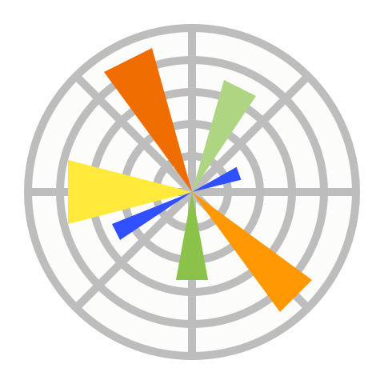
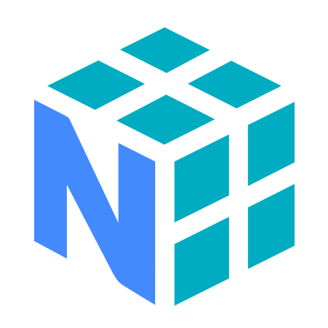

<!--
**sanika172005/sanika172005** is a ✨ _special_ ✨ repository because its `README.md` (this file) appears on your GitHub profile.

Here are some ideas to get you started:

- 🔭 I’m currently working on ...
- 🌱 I’m currently learning ...
- 👯 I’m looking to collaborate on ...
- 🤔 I’m looking for help with ...
- 💬 Ask me about ...
- 📫 How to reach me: ...
- 😄 Pronouns: ...
- ⚡ Fun fact: ...
-->

 

 ###  About Me  

**AI/ML · Modern Web Enthutiast ♾️ · UI Designing**  
B.E undergraduate at [DVVPCOE] . 

> *Curious by nature, disciplined in effort, and consistent in learning.*

<!-- ==============Current Status============= --->
### Working On  
    
- Data Cleaning , Processing for ML
- Implementing Ideas that solves a real-time solution
- Practicing Mathematical functions ♾️
- Exploring React and UI Libraries 🔑
 
 

<!--
**omkar-077/omkar-077** is a ✨ _special_ ✨ repository because its `README.md` (this file) appears on your GitHub profile.

Here are some ideas to get you started:

- 🔭 I’m currently working on ...
- 🌱 I’m currently learning ...
- 👯 I’m looking to collaborate on ...
- 🤔 I’m looking for help with ...
- 💬 Ask me about ...
- 📫 How to reach me: ...
- 😄 Pronouns: ...
- ⚡ Fun fact: ...
-->
<h2 align="center">  My Tech Stack  </h2>

These are the technologies I work with — languages, libraries, tools, and platforms I use regularly.

<table align="center">

<!-- ========== LANGUAGES & FRONTEND ========== -->
<tr>
  <td align="center" width="96"> Java</td>
  <td align="center" width="96"> Python</td>
  <td align="center" width="96"> JavaScript</td>
  <!-- <td align="center" width="96"> TypeScript</td> -->
  <td align="center" width="96"> C++</td>
  <td align="center" width="96"> React</td>
  <td align="center" width="96"> Html</td>
  <td align="center" width="96"> CSS</td>
   <td align="center" width="96"> Bootstrap</td>
  <!-- <td align="center" width="96"> Webpack</td> -->
</tr>

<!-- ========== BACKEND & DATABASES ========== -->
<tr>
  <td align="center"> Node.js</td>
  <td align="center"> Express.js</td>
  <td align="center"> Redux</td>
  <td align="center"> REST API</td>
  <td align="center"> MySQL</td>
  <td align="center"> MongoDB</td>
  <td align="center"> Matplotlib</td>
   <td align="center" width="96"> Postman</td>
  <!-- <td align="center"> Redis</td>
  <td align="center"> Kafka</td>
  <td align="center"> Prometheus</td> -->
</tr>

<!-- ========== DEVOPS & TOOLS ========== -->
<tr>
  <!-- <td align="center"> Grafana</td>
  <td align="center"> Docker</td>
  <td align="center"> Jenkins</td> -->
  <!-- <td align="center"> G-Actions</td> -->
  <!-- <td align="center"> AWS</td> -->
  <td align="center"> Git</td>
  <td align="center"> GitHub</td>
  <td align="center"> VS Code</td>
   <td align="center"> Anaconda</td>
   <td align="center"> Ubuntu</td>
  <!-- <td align="center"> Tailwind</td> -->
  <td align="center"> Numpy</td>
   <td align="center"> Pandas</td>
   
</tr>

<!-- ========== OS & HARDWARE ========== -->
<!-- <tr>
  <!-- <td align="center"> pnpm</td>
  <td align="center"> Arduino</td>
  <td align="center"> Linux</td> -->
<!-- </tr> --> -->

</table>

 

 
### Connect With Me   
  

 

 

